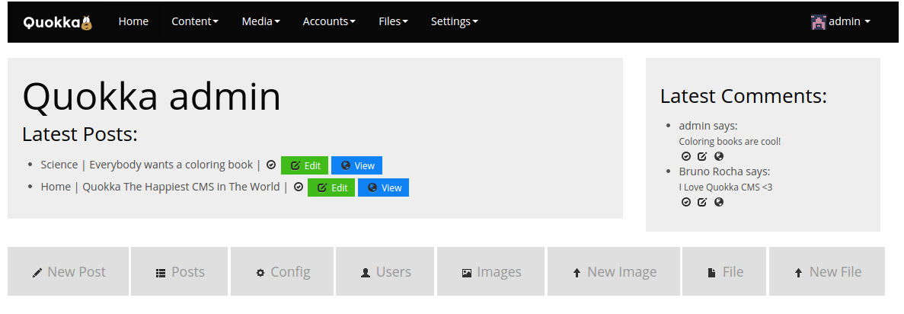

[](https://travis-ci.org/quokkaproject/quokka)
[](https://coveralls.io/r/quokkaproject/quokka)
[](http://twitter.com/quokkaproject)
[](https://quokkaslack.herokuapp.com/)
[](https://quokkaproject.slack.com/messages/)
[](https://landscape.io/github/quokkaproject/quokka/master)
<a href="http://smallactsmanifesto.org" title="Small Acts Manifesto"></a>

[](https://app.wercker.com/project/bykey/e9cbc4497ee946083aa19fbd3f756c91)

Quokka project
===============================================

### Flask and MongoDB powered CMS

<p align="center">

</p>


Quokka is a flexible content management platform powered by Python, Flask and MongoDB.

<p align="center">

</p>


Quick start
============
> Quokka runs on Python 2.7


1. Get Quokka and enters its root directory
    ```bash
    git clone https://github.com/quokkaproject/quokka
    cd quokka
```

2. Prepare the environment

    1. Install needed packages in your local computer

    You can install everything you need in your local computer or if preferred use a virtualenv for Python

        1. Quokka require a MongoDB instance running to connect. 

            1. If you don't have a MongoDB instance running, you can quickly configure it:
                * Download from [here](https://www.mongodb.org/downloads) 
                * Unzip the file
                * Open a separate console
                * Run it inside the MongoDB directory:
                    ```bash
                    ./bin/mongod --dbpath /tmp/
                    ```
                    
                > WARNING: If you want to persist the data, give another path in place of ```--dbpath /tmp```

            2. If you already have, just define your MongoDB settings:
                ```bash
                $ $EDITOR quokka/local_settings.py
                ===============quokka/quokka/local_settings.py===============
                MONGODB_SETTINGS = {'DB': 'your_mongo_db', 'HOST': 'host_ip', 'PORT': '27017'}
                DEBUG = True
                =============================================================
                ```

            3. (optional) If you have Docker installed you can simply run the official Mongo image
                ```bash
                cd quokka
                docker run -d -v $PWD/etc/mongodata:/data/db -p 27017:27017 mongo
                ```

        2. Install requirements

            1. O.S Requirements (for media conversions)

            you may need the following requirements on your operating system 
            - Ubuntu/Debian:
                ```bash
                sudo apt-get install libtiff5-dev libjpeg8-dev zlib1g-dev libfreetype6-dev
                ```
            - Alpine
                ```bash
                apk add gcc python py-pip libjpeg zlib zlib-dev tiff freetype git py-pillow python-dev musl-dev
                ```

            2. Python requirements
                ```bash
                pip install -r requirements.txt
                ```

        3. Populate with sample data (optional)

        ```bash
        $ python manage.py populate

        ```

        4. Create a superuser

        ```bash
        $ python manage.py createsuperuser
        you@email.com
        P4$$W0Rd
        ```

        5. Run

        ```bash
        $ python manage.py runserver --host 0.0.0.0 --port 5000
        ```
        - Site on http://localhost:5000
        - Admin on http://localhost:5000/admin


    2. Run in Docker

    The easiest way to run Quokka for development is in Docker, you will need docker and docker compose installed in your machine

    > Once in Docker all data is stored behind quokka/etc folder

    - **Docker** - https://docs.docker.com/installation/
    - **Docker-Compose** - https://docs.docker.com/compose/install/

    Ensure that local port 27017(mongo) is not being used on your computer

        1. Run with compose
        
            1. Easiest way just run
            ```bash
            docker-compose up
            ```

            > use -d on above to leave it as a daemon

            2. Enter Quokka Shell (in a separate console)
            ```bash
            docker-compose run shell python manage.py shell
            ```

            3. Run Quokka Commands (in a separate console)
            ```bash
            docker-compose run shell python manage.py populate
            ```


        2. Run standalone containers (each in separate shells or use -d option)
            1. run mongo container
            ```bash
            docker run -v $PWD/etc/mongodata:/data/db -p 27017:27017 --name mongo mongo
            ```

            2. run quokka web app container
            ```bash
            docker run -e "QUOKKA_MONGODB_HOST=mongo" -p 5000:5000 --link mongo:mongo -v $PWD:/quokka --workdir /quokka -t -i quokka/quokkadev python manage.py runserver --host 0.0.0.0

            ```

            3. run quokka shell if needed
            ```bash
            docker run -e "QUOKKA_MONGODB_HOST=mongo" -p 5000:5000 --link mongo:mongo -v $PWD:/quokka --workdir /quokka -t -i quokka/quokkadev python manage.py shell

            ```

    
Documentation is not complete yet, but is being written at:

http://quokkaproject.org/documentation

> If you want to help writing the docs please go to https://github.com/quokkaproject/quokkaproject.github.io


Also there is a [Wiki](https://github.com/quokkaproject/quokka/wiki)
===============================================

> NOTE: the content from wiki will be moved to /documentation

* [About & Features](https://github.com/quokkaproject/quokka/wiki/about)
* [Installing and running](https://github.com/quokkaproject/quokka/wiki/installation)
* [Requirements](https://github.com/quokkaproject/quokka/wiki/requirements)
* [Extending & Installing modules](https://github.com/quokkaproject/quokka/wiki/plugins)
* [Admin interface](https://github.com/quokkaproject/quokka/wiki/screencast)
* [Project tree](https://github.com/quokkaproject/quokka/wiki/project-tree)
* [Team & Committers](https://github.com/quokkaproject/quokka/graphs/contributors)


Hosting
=======

You can host a Quokka website in any VPS or cloud which supports Python and Flask + MongoDB access, a good option is to host the database in MongoLab if your hosting server does not provide Mongo.

- PythonAnywhere can run Quokka with Mongo hosted at MongoLab
- DigitalOcean is a good option for a VPS
- Jelastic Cloud has the easiest Quokka deployment - http://docs.jelastic.com/ru/quokka-cms

Is it any good?
==============

[Yes!](https://news.ycombinator.com/item?id=3067434)


&nbsp;

&nbsp;

&nbsp;
[](http://github.com/pythonhub)

## FAQ

### Why another CMS?

There is a large number of great CMS's in Python ecosystem (Plone, Opps, Mezannine, DjangoCMS etc), each one has its own patterns for extension development and theme management. A CMS can take a its role as "Product" or as "Platform" and for Quokka the idea is to play in both scenarios, The CMS should be easy to deploy, extensions and themes should be "drop-in", it should be easy to develop extensions and also it should use a "schema-free" database. Until Quokka there was no CMS filling all these needs.

### Why Flask?

Because Flask is Pythonic! In my research + experience it is the best framework to develop applications which rely on "pluggable features" thanks to its Blueprints and Extension patterns, also Flask plays well with any DB/ORM of choice. (see next question)

### Why MongoDB?

Because database scheme migrations are no-happy for CMS and a Quokka CMS must be always happy to work with, so no-schema-migrations is needed with MongoDB! and Mongo is the easiest, flexible and most suitable NoSQL for CMS, also there is excellent extensions for Flask (MongoEngine and Flask-Admin) which supports MongoDB!

### Why the project is named "Quokka?"

Because it is the happiest animal in the world!

#### 20 FACTS ABOUT QUOKKAS

- 1. Happiest animal in the world because they are known for how much they smile.
- 2. They are marsupials
- 3. They live on rottnest island named after quokkas because a Dutch guy thought they were large rats. Rottnest means "rats nest"
- 4. They can climb trees
- 5. Herbivores-they eat leaves,stems,grass,etc;
- 6. They are nocturnal
- 7. They can live for long periods of time, living off of the fat stored in their tails lol
- 8. Females usually give birth once a year
- 9. Quokkas are old enough to have babies at 1.5 years old!!
- 10. Live 5-10 years
- 11. Declining population—logging, pollution, killed by foxes,pet dogs, pet cats, humans,etc;😭😭
- 12. They live in tall grass near water
- 13. Btw if you meet a quokka don't feed it anything due to declining population because it could affect them
- 14. Quokkas highest speed is 20mph
- 15. They don't chew food.they just swallow it
- 16. Closely related to the Rock Wallaby (in the picture^^^)
- 17. Scientific name is Setonix Brachyurus
- 18. Joey stays with mom for 35 weeks
- 19. Quokkas recycle a small amount of their bodies waste products
- 20. They create their own trails and paths to get food and runaway from predators.

## License
This project is licensed under the [MIT license](http://opensource.org/licenses/MIT), see `LICENSE` for more details.
