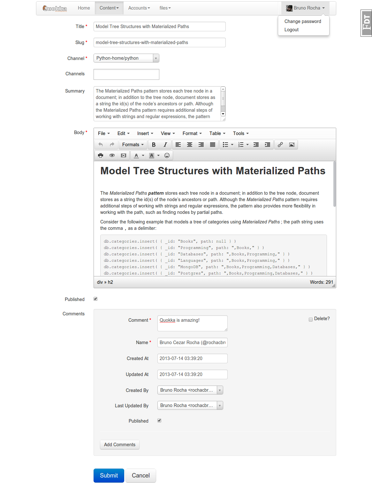

[](http://flattr.com/thing/1680610/rochacbrunoquokka-on-GitHub)
[](https://www.gittip.com/rochacbruno/)
[](https://travis-ci.org/pythonhub/quokka)
[](http://twitter.com/quokkaproject)

Quokka project
===============================================

### Flask and MongoDB powered CMS
#### (alpha version, work in progress)

<p align="center">

</p>


Quokka is a flexible content management platform powered by Python, Flask and MongoDB.

Quokka provides a "full-stack" Flask application plus a bunch of selected extensions to provide all the needed CMS admin features and a flexible-easy way to extend the platform with **quokka-modules** built following the Flask **Blueprints** pattern.


Current features
================
- Customizable admin interface
- Export data to json or csv
- Channel based content organization with multi-level unlimited nested channels (MPTT)
- Beauty urls and SMART-SLUG
- Default basic website theme based on zurb.foundation css framework
- Extensible with Flask Blueprints modules
- Management commands
- Celery ready
- Blog/News posting app
- Comments
- Role Based Access control for content and admin interface
- Admin file browser
- Tinymce WISIWYG Editor
- Mobile detect middleware (if needed, defaut is responsible)
- Multi themes based in [Flask themes](https://flask-themes2.readthedocs.org/en/latest/)


Installing and running
======================

> NOTE: Quokka was tested in Linux and MacOs running in virtual-env with Python 2.7.

> Requires Python 2.7+ (Python3 support is planed).


> IMPORTANT: Use ```pip install -r requirements.txt``` to install dependencies, some packages are setted to specific versions.

#### On a *nix shell, do:

```bash
~/$ virtualenv quokka-env
~/$ ... creating virtualenv in quokka-env........
~/$ cd quokka-env
~/quokka-env$ source bin/activate
(quokka-env)~/quokka-env$ git clone https://github.com/rochacbruno/quokka
(quokka-env)~/quokka-env$ ...cloning in to quokka
(quokka-env)~/quokka-env$ cd quokka
(quokka-env)~/quokka-env/quokka$ pip install -r requirements.txt
```


#### configure your DATABASE settings

> Note: You need to have mongoDB installed on your server, optionally you can use mongolab.

```bash
(quokka-env)~/quokka-env/quokka$ youreditor quokka/settings.py
######## YOUR EDITOR ################

MONGODB_SETTINGS = {'DB': "the_name_of_your_mongo_database"}

######################################
```

#### Test (optional)

> NOTE: Before running the tests you need to specify a database connection for tests in test_settings.py

```bash
(quokka-env)~/quokka-env/quokka$ python runtests.py
...
----------------------------------------------------------------------
Ran 400 tests in 0.230s

OK

```

#### Create a super user
```bash
(quokka-env)~/quokka-env/quokka$ python manage.py createsuperuser
Name: Input your name
Email: You@You.com
password: ***not1234***
```

#### Run
```bash
(quokka-env)~/quokka-env/quokka$ python manage.py runserver
17.07 17:06:24 werkzeug     INFO      * Running on http://127.0.0.1:5000/
```

#### Enjoy!

- Sample home page: http://localhost:5000
- Admin interface http://localhost:5000/admin

> NOTE: There are **make** commands available for test: make test, run: make run, shell: make shell

<p align="center">
   
</p>


Populating with sample data
===========================

You can populate Quokka **Channels**, **Users** and **Posts** with sample data

```bash
(quokka-env)~/quokka-env/quokka$ python manage.py populate
```

The above command will add some content and 3 users

- admin@example.com password: admin
- editor@example.com password: editor
- moderator@example.com password: moderator

> The populate script is in ```utils/populate``` needs some work to populate using a json or yaml file, can you help?

Extending
==========

Quokka tries to implement the Django-ish way to implement **quokka-modules** it means that you can develop like this:

```bash
quokka/modules
│
└── posts
    ├── admin.py  - defines the admin pages
    ├── commands.py - create management commands here
    ├── __init__.py - define module and routes
    ├── models.py - define the Mongo Documents models
    ├── populate.py - optional example fixtures
    ├── tasks.py - Tasks is for celery tasks
    ├── template_filters.py - Jinja filters
    ├── templates
    │   └── posts
    │       ├── detail.html
    │       └── list.html
    └── static
    └── views.py - module views
```


> **Important** - read more about developing modules in the docs, to avoid name conflicts your module should follow the naming pattern described in docs.

Installing modules
===================

**There is no need to install** or include your modules in config files or change quokka code to load the module.

Just drop your module package in **quokka/modules** restart your server and done!

Quokka admin also provides a web interface for admin-users to install and ENABLE/DISABLE modules.

Admin interface
================

Admin interface is powered by Flask-Admin customized with access control and theme tweaks.

Listing


Posting



Requirements
============
- Python 2.7
- Flask
- mongoengine
- Babel
- Flask-Cache
- Flask-DebugToolbar
- Flask-Gravatar
- Flask-HTMLBuilder
- Flask-Mail
- Flask-Script
- Flask-Security
- Flask-Admin
- Flask-Testing
- Flask-WTF
- Flask-Mongoengine


Project tree
============
```bash
.
quokka
├── Makefile
├── manage.py
├── quokka
│   ├── babel
│   │   ├── babel.bat
│   │   ├── babel.ini
│   │   ├── babel.sh
│   │   └── quokka.pot
│   ├── bin
│   │   ├── __init__.py
│   │   └── quokka-admin.py
│   ├── contrib
│   │   └── __init__.py
│   ├── core
│   │   ├── admin
│   │   │   ├── __init__.py
│   │   │   ├── models.py
│   │   │   └── views.py
│   │   ├── app.py
│   │   ├── db.py
│   │   ├── __init__.py
│   │   ├── middleware.py
│   │   ├── models.py
│   │   ├── templates.py
│   │   ├── views.py
│   │   └── widgets.py
│   ├── ext
│   │   ├── babel.py
│   │   ├── before_request.py
│   │   ├── blueprints.py
│   │   ├── context_processors.py
│   │   ├── error_handlers.py
│   │   ├── fixtures.py
│   │   ├── generic.py
│   │   ├── __init__.py
│   │   ├── template_filters.py
│   │   ├── themes.py
│   │   └── views.py
│   ├── media
│   │   ├── files
│   │   └── images
│   │       ├── 2PsPN.jpeg
│   │       ├── 2PsPN_thumb.jpg
│   │       ├── dopy.png
│   │       ├── dopy_thumb.jpg
│   │       ├── period.jpg
│   │       ├── period_thumb.jpg
│   │       ├── quokka_beach.jpg
│   │       └── quokka_beach_thumb.jpg
│   ├── modules
│   │   ├── accounts
│   │   │   ├── admin.py
│   │   │   ├── commands.py
│   │   │   ├── __init__.py
│   │   │   └── models.py
│   │   ├── __init__.py
│   │   └── posts
│   │       ├── admin.py
│   │       ├── commands.py
│   │       ├── __init__.py
│   │       ├── models.py
│   │       ├── tasks.py
│   │       ├── template_filters.py
│   │       ├── templates
│   │       │   └── posts
│   │       │       ├── detail.html
│   │       │       └── list.html
│   │       └── views.py
│   ├── static
│   │   ├── admin
│   │   │   └── custom.js
│   │   ├── css
│   │   │   └── main.css
│   │   ├── favicon.ico
│   │   ├── img
│   │   │   └── logo.png
│   │   ├── js
│   │   │   └── main.js
│   │   ├── robots.txt
│   │   └── tinymce
│   ├── templates
│   │   ├── admin
│   │   │   ├── base.html
│   │   │   ├── custom
│   │   │   │   ├── create.html
│   │   │   │   ├── edit.html
│   │   │   │   └── _lib.html
│   │   │   ├── denied.html
│   │   │   └── index.html
│   │   ├── base.html
│   │   ├── content
│   │   │   ├── detail.html
│   │   │   └── list.html
│   │   ├── errors
│   │   │   ├── access_forbidden.html
│   │   │   ├── method_not_allowed.html
│   │   │   ├── page_not_found.html
│   │   │   └── server_error.html
│   │   ├── _forms.html
│   │   ├── _menu.html
│   │   └── security
│   │       ├── change_password.html
│   │       ├── email
│   │       │   ├── change_notice.html
│   │       │   ├── change_notice.txt
│   │       │   ├── confirmation_instructions.html
│   │       │   ├── confirmation_instructions.txt
│   │       │   ├── login_instructions.html
│   │       │   ├── login_instructions.txt
│   │       │   ├── reset_instructions.html
│   │       │   ├── reset_instructions.txt
│   │       │   ├── reset_notice.html
│   │       │   ├── reset_notice.txt
│   │       │   ├── welcome.html
│   │       │   └── welcome.txt
│   │       ├── forgot_password.html
│   │       ├── login_user.html
│   │       ├── _macros.html
│   │       ├── _menu.html
│   │       ├── _messages.html
│   │       ├── register_user.html
│   │       ├── reset_password.html
│   │       ├── send_confirmation.html
│   │       └── send_login.html
│   ├── tests
│   │   ├── __init__.py
│   │   ├── test_basic.py
│   │   └── test_text_utils.py
│   ├── themes
│   │   └── default
│   │       ├── favicon.ico
│   │       ├── img
│   │       │   └── logo.png
│   │       ├── info.json
│   │       ├── license.txt
│   │       ├── static
│   │       │   ├── css
│   │       │   │   └── main.css
│   │       │   └── js
│   │       │       └── main.js
│   │       └── templates
│   │           ├── base.html
│   │           ├── content
│   │           │   ├── detail.html
│   │           │   └── list.html
│   │           └── _helpers.html
│   ├── __init__.py
│   ├── local_settings.py
│   ├── test_settings.py
│   ├── settings.py
│   └── utils
│       ├── dateformat.py
│       ├── __init__.py
│       ├── populate.py
│       ├── routing.py
│       ├── settings.py
│       ├── text.py
│       └── translation.py
├── README.md
├── requirements.txt
├── roadmap.md
├── run.py
├── runtests.py
├── setup.py
└── wsgi.py

97 directories, 242 files
```


&nbsp;

&nbsp;

&nbsp;
[](http://github.com/pythonhub)

